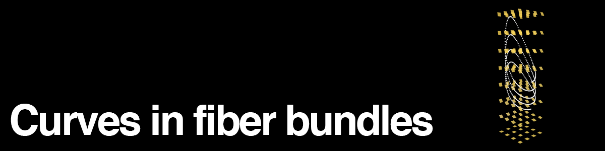

# Haskellonomy

- [U1 Animation](https://www.youtube.com/watch?v=wT2hbgcB6DE)
- [R1 Animation](https://www.youtube.com/watch?v=xWdUWk9Hexg)

Go check out [ **src/LiftClassic** ] to see it in action.

This follows from initial work done by Eric Weinstein.

This program is at its core an ODE solver that respects some group action. The algorithms are in terms of typeclasses for fibers and base manifolds.

- Fibers implemented

  - U(1)
  - Positive reals under multiplication
  - Reals under addition

- Base manifolds implemented
  - R1, R2, R3

## What it can't do yet

- Levi-Civita connections
- Base manifolds besides R^n
- General parallel transport of economic [ **src/LiftIndex** ] baskets (not just the index multiple)

## How to add a new base manifold or fiber type

The typeclasses are in [ **src/HoloTypes** ].

- Fibers are Lie groups so instantiate

  - LieAlgebra
  - Group
  - An exponential map from the algebra to the group
  - And now you have a LieGroup

- Manifold
  - Needs to have ManifoldPoint

## How to run the program

Use [stack](https://docs.haskellstack.org/en/stable/README/)

- stack install (compile to file) or ...
- stack run (run the program) or ...
- stack ghci (use the library interactively)
